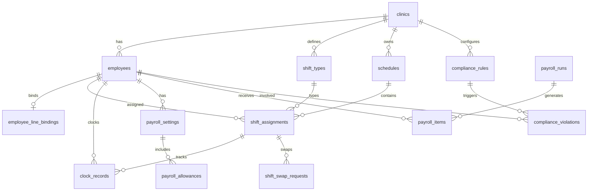

# 資料庫 Schema 設計說明

## ER 關係概覽

---

## 核心資料表

### 1. `employees` — 員工表

| 欄位 | 型別 | 說明 |
|------|------|------|
| `id` | UUID | 主鍵 |
| `clinic_id` | UUID | 所屬診所 |
| `employee_no` | TEXT | 員工編號（診所內唯一） |
| `name` | TEXT | 姓名 |
| `role` | ENUM | nurse / admin / doctor / staff |
| `employment_type` | ENUM | full_time / part_time / contract |
| `status` | ENUM | active / inactive / resigned |
| `weekly_rest_day` | SMALLINT | 例假日（0=週日） |
| `daily_work_hours` | NUMERIC | 每日正常工時（預設 8） |
| `auth_user_id` | UUID | Supabase Auth 關聯 |

**設計考量：** 初期 2 位護理師，`role = 'nurse'`；診所負責人可設 `admin`。`weekly_rest_day` 供合規引擎檢查「每七日出勤」規則。

---

### 2. `shift_types` — 班別定義

| 欄位 | 型別 | 說明 |
|------|------|------|
| `code` | TEXT | MORNING / AFTERNOON / EVENING / CLOSED |
| `category` | ENUM | morning / afternoon / evening / closed / custom |
| `start_time` | TIME | 班別開始（如 08:00） |
| `end_time` | TIME | 班別結束（如 12:00） |
| `break_minutes` | INTEGER | 休息分鐘數 |
| `planned_hours` | NUMERIC | 預排工時（扣休息後，供合規計算） |

**診所預設班別範例：**

| 名稱 | 時間 | planned_hours |
|------|------|---------------|
| 早診 | 08:00–12:00 | 4.0 |
| 午診 | 14:00–17:30 | 3.5 |
| 晚診 | 18:00–21:00 | 3.0 |
| 休診 | — | 0 |

---

### 3. `schedules` + `shift_assignments` — 班表

**`schedules`**：以「診所 + 年月」為單位管理整月班表，支援 draft → published 流程。發布後觸發 LINE 通知。

**`shift_assignments`**：每位員工每日的具體排班。

| 欄位 | 型別 | 說明 |
|------|------|------|
| `employee_id` | UUID | 排班員工 |
| `shift_type_id` | UUID | 班別 |
| `work_date` | DATE | 工作日期 |
| `status` | ENUM | scheduled / confirmed / cancelled |
| `start_time` / `end_time` | TIME | 可覆寫班別預設時間 |

**唯一約束：** `(employee_id, work_date, shift_type_id)` — 同一員工同一天同一班別只能有一筆。

**換班流程：** `shift_swap_requests` 關聯 `original_assignment_id`，審核通過後更新 assignment 的 `employee_id`。

---

### 4. `clock_records` — 打卡紀錄

| 欄位 | 型別 | 說明 |
|------|------|------|
| `clock_type` | ENUM | clock_in / clock_out / break_start / break_end |
| `clocked_at` | TIMESTAMPTZ | 實際打卡時間 |
| `geo_lat` / `geo_lng` | NUMERIC | GPS 座標 |
| `geo_accuracy_m` | NUMERIC | GPS 精度（公尺） |
| `distance_from_clinic_m` | NUMERIC | 距離診所距離（計算後存入） |
| `validation` | ENUM | valid / invalid_location / invalid_time / manual_override |
| `source` | ENUM | line_liff / line_rich_menu / admin_manual |
| `assignment_id` | UUID | 關聯當日排班（可空，供比對） |

**防作弊機制：**
1. LIFF 取得 GPS → 後端以 Haversine 公式計算距離
2. 超出 `clinics.geo_radius_m`（預設 200m）→ `validation = 'invalid_location'`
3. 比對排班時間 → 遲到 / 早到標記

---

### 5. `payroll_settings` — 薪資設定

| 欄位 | 型別 | 說明 |
|------|------|------|
| `salary_type` | ENUM | monthly（月薪制）/ hourly（時薪制） |
| `base_salary` | NUMERIC | 月薪或時薪基數 |
| `hourly_rate` | NUMERIC | 時薪（加班費計算基礎） |
| `ot_rate_weekday` | NUMERIC | 平日加班倍率（預設 1.34） |
| `ot_rate_weekday_2h` | NUMERIC | 平日第 3-4 小時（預設 1.67） |
| `ot_rate_rest_day` | NUMERIC | 休息日加班（預設 1.34） |
| `ot_rate_holiday` | NUMERIC | 例假日加班（預設 2.00） |
| `full_attendance_bonus` | NUMERIC | 全勤獎金 |
| `effective_from` / `effective_to` | DATE | 生效期間（支援調薪歷程） |

**`payroll_allowances`**：彈性津貼項目

| allowance_type | 說明 | 計算方式 |
|----------------|------|----------|
| `clinic_fee` | 診費津貼 | 固定或依晚診次數 |
| `full_attendance` | 全勤獎金 | 當月無缺勤/遲到 |
| `night_shift` | 夜班津貼 | 晚診 >= N 次 |
| `holiday` | 假日津貼 | 國定假日出勤 |

---

### 6. `payroll_runs` + `payroll_items` — 薪資結算

**`payroll_runs`**：每月一期薪資結算（draft → calculated → approved → paid）。

**`payroll_items`**：每位員工的薪資明細

| 欄位 | 說明 |
|------|------|
| `regular_hours` | 正常工時 |
| `overtime_hours` | 加班工時（第 1-2 小時） |
| `overtime_hours_2tier` | 加班工時（第 3-4 小時，1.67 倍） |
| `base_pay` | 本薪 |
| `overtime_pay` | 加班費 |
| `allowance_total` | 津貼合計 |
| `deduction_total` | 扣款合計 |
| `gross_pay` / `net_pay` | 應發 / 實發 |
| `breakdown` | JSONB 明細（各項津貼、扣款） |

---

### 7. `compliance_rules` + `compliance_violations` — 勞基法合規

**內建規則（種子資料）：**

| rule_code | 門檻 | 嚴重度 | 法源 |
|-----------|------|--------|------|
| `MAX_DAILY_HOURS` | 8 hr | violation | 勞基法 §30 |
| `MAX_WEEKLY_HOURS` | 40 hr | violation | 勞基法 §30 |
| `MAX_OT_DAILY` | 4 hr | violation | 勞基法 §32 |
| `MAX_OT_MONTHLY` | 46 hr | violation | 勞基法 §32 |
| `MIN_REST_BETWEEN` | 11 hr | violation | 勞基法 §34 |
| `WEEKLY_REST_DAY` | 1 day/7 | violation | 勞基法 §36 |
| `MAX_CONSECUTIVE_DAYS` | 6 days | warning | 勞基法 §36 |
| `CLOCK_LOCATION` | 200 m | warning | — |
| `CLOCK_TIME_LATE` | 5 min | warning | — |
| `MISSING_CLOCK_OUT` | — | warning | — |

**觸發時機：**
- 排班儲存 / 發布 → 檢查工時、休息間隔
- 打卡完成 → 檢查地點、時間異常
- 每日排程 Job → 檢查累計加班、連續出勤

**通知管道：** `notified_via = ['line', 'admin_dashboard']`

---

## 索引策略

| 表 | 索引 | 用途 |
|----|------|------|
| `shift_assignments` | `(employee_id, work_date)` | 查個人班表 |
| `clock_records` | `(employee_id, clocked_at DESC)` | 查打卡紀錄 |
| `compliance_violations` | `(clinic_id, status)` | 後台未處理警示 |
| `payroll_settings` | `(employee_id, effective_from DESC)` | 取最新薪資設定 |

---

## 擴充預留

| 未来需求 | 擴充方式 |
|----------|----------|
| 多診所 | `clinics` 已有，RLS 依 `clinic_id` 隔離 |
| 更多護理師 | `employees` 直接新增，無 schema 變更 |
| 請假管理 | 新增 `leave_requests` 表 |
| 國定假日 | 新增 `holidays` 表 + 合規規則 |
| 醫師排班 | `role = 'doctor'`，共用同一套 schedule |
